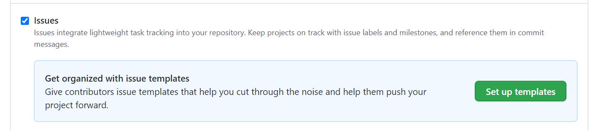
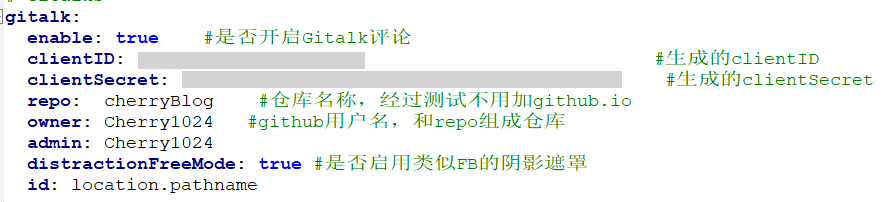
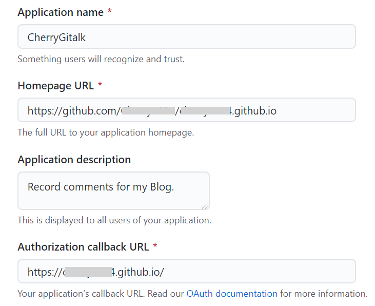
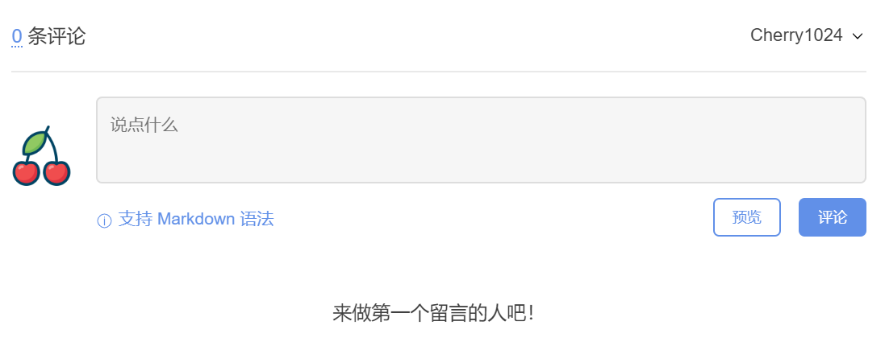

> 这两天学习了 [BY]('https://github.com/qiubaiying/qiubaiying.github.io') 的教程搭建了自己的博客，申请使用了`Gitalk`的评论功能，关于`Gitalk`的使用和配置大家可以参考别的教程，这里主要记录一个困扰我一晚上的问题——Error: Not Found.

这个👇是错误截图

### 解决方案

#### 1. 新建存放评论的仓库

##### 新建一个仓库

##### 启用Setting>Features>issues

#### 2. *_config.yaml* 的配置 

> 我遇到的第一个坑 :baby:

_这个👇是 *`config.yaml`*的配置信息

📕 **clientID** 和 **clientSecret**是OAuth Apps 申请时生成的（下面还会提到）

📕 **ower**和**admin**都写GitHub用户名即可，如果admin有多个管理者，就以数组形式

📕 **repo** 这里直接写存储评论的远端仓库名称即可，之前看很多文档说要写仓库地址之类的，比如：xx.github.io 或者 github.com/xx/xx/github.io 等，但我这里都不work，页面刷新出来依旧会报错或者无法加载。这里参考了一条[issue]('https://github.com/gitalk/gitalk/issues/379') ，**原理**应该是：

> owner和repo组成的这个地址 github.com/owner/repo 是放置评论的仓库，因此不需要写完整地址，

#### 3. 创建 Github Application

> 我遇到的第二个坑 :baby:

> Gitalk 需要一个 **Github Application**，[点击这里申请]('https://github.com/settings/applications/new') 。实际要在【2】之前，因为要先获取ID 和 Secret

上面改完之后遇到新的问题……

虽然不再显示`Error:Not Found`,但是显示`未找到相关的 Issues 进行评论` 👇 ，一点登录就会一直加载

然后各种检查配置，测试。后来又搜到了一篇[博客]('https://blog.csdn.net/qing_gee/article/details/100133060') ，发现可能是OAuth配置的问题。

📕 Application name 自己新建一个名字即可

📕 Authorization callback URL 是博客的域名，如果你指向了新的域名，那就写新的域名，但我目前还没有申请，所以直接用的仓库名字

📕 Homepage URL 必须是博客仓库的域名（GitHub Pages 的），我之前写的是和Authorization callback URL一样的，就会出现上面说的错误，然后改成现在的就work了。

😊😊😊 DONE!

